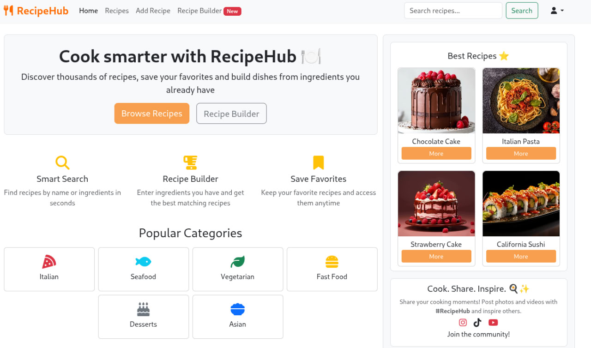
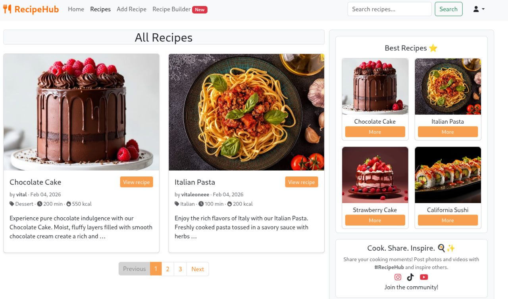
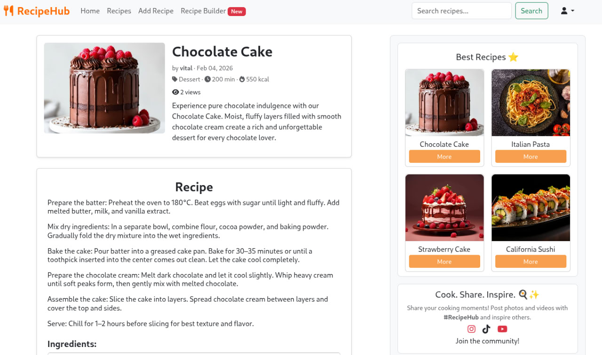
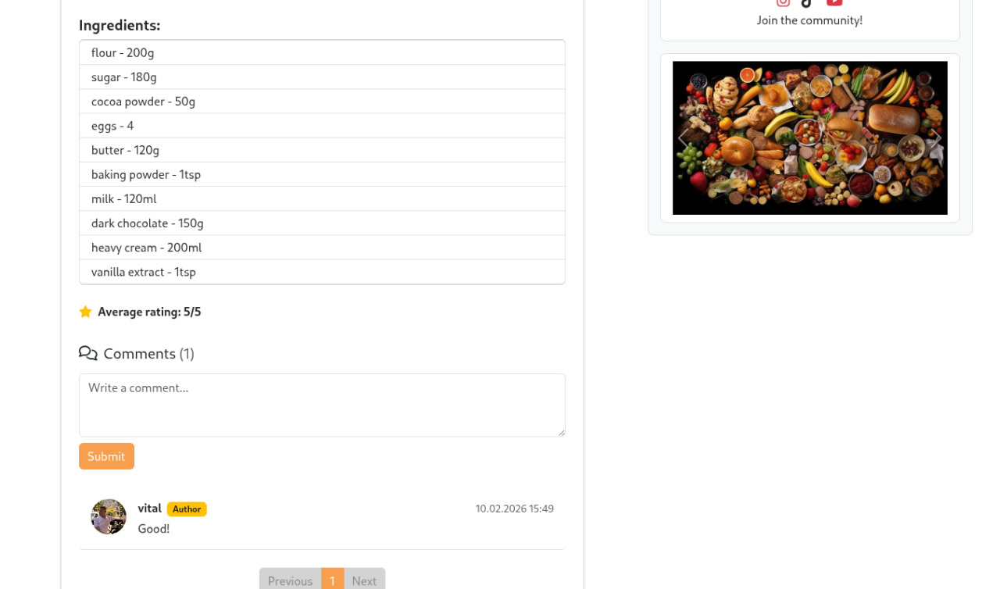
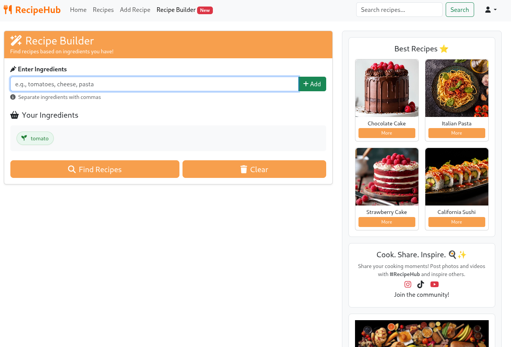
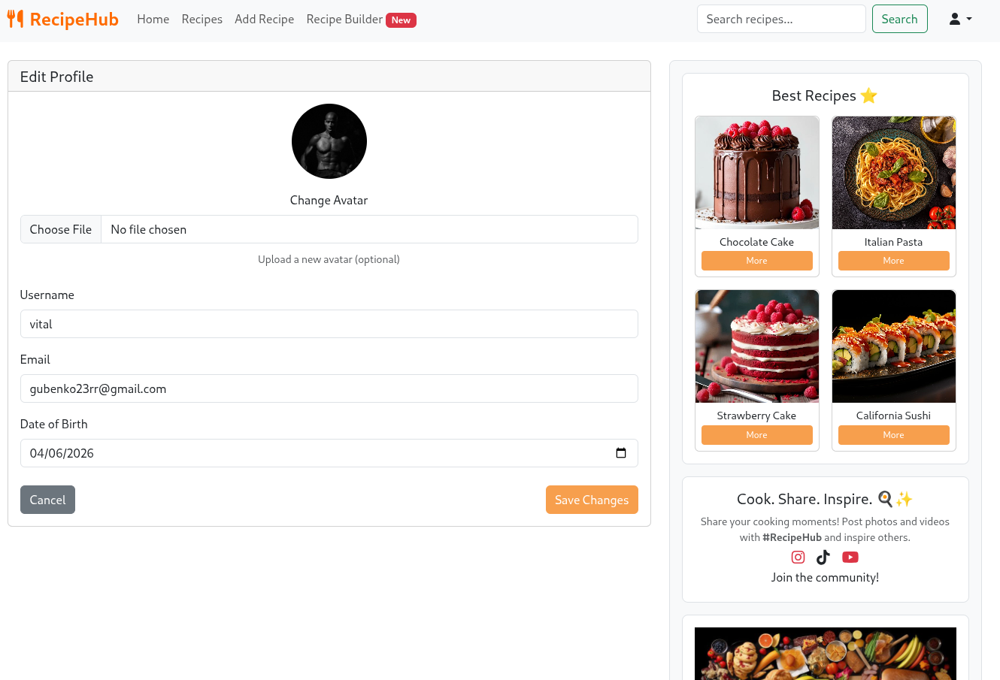

# Recipe Hub

RecipeHub is a modern web platform for sharing and discovering culinary recipes.
Users can create, publish, and explore recipes from a vibrant community of food enthusiasts.
The platform features a comprehensive moderation system, user favorites, ratings, and comments,
making it easy to find and share amazing dishes.
Built with Django and Django REST Framework, RecipeHub provides both a user-friendly web interface and a powerful
RESTful API for seamless integration and mobile app development.

## Features

### User Management

- User registration and authentication with email verification
- Custom user profiles with photos and personal information
- JWT-based API authentication for secure access
- Automated welcome emails via Celery background tasks

### Recipe Management and Social Features

- Create your recipes with detailed information
- Rich recipe data: ingredients, cooking instructions, servings, cooking time, and calories
- Photo uploads for recipes
- Automatic slug generation for SEO-friendly URLs
- User favorites system - save recipes you love
- Recipe ratings (1-5 stars)
- Comments on recipes

### API Capabilities

- Full RESTful API with DRF
- Pagination and filtering on all list endpoints
- JWT authentication with token refresh

### Caching & Performance

- Redis caching for improved performance
- Optimized database queries
- Best recipes caching in context processors

## Technologies

* Python 3.12
* Django 6.0/DRF 3.16
* PostgreSQL
* Redis
* Celery

## 👨‍💻 Docker Installation

1. Clone the repository
    ```bash
    git clone https://github.com/vitaleoneee/recipehub.git
    cd recipehub

2. Create an .env file and fill the required variables:
   ```bash
   cp .env.example .env
   
   # Fill the variables in the newly created file with your data
      DB_NAME=your-db-name
      DB_USER=your-db-user
      DB_PASSWORD=your-db-password
      ...

3. Build and run the containers:
    ```bash
    docker compose up --build

This will automatically:

* Wait for PostgreSQL
* Apply migrations
* Start the Django server

🔧 Useful Docker Commands

1. Rebuild containers:
    ```bash
    docker compose up --build

2. Run in background:
    ```bash
    docker compose up -d

3. Stop:
    ```bash
    docker compose down

4. View logs:
    ```bash
   docker compose logs -f

## Below is a detailed guide on how to install the application WITHOUT Docker and NGINX 👇

<details>
Installation

1. Clone the repository or copy the project folder to your local machine.
    ```bash
    git clone https://github.com/vitaleoneee/recipehub.git

2. Navigate to the project folder:
   ```bash
   cd recipehub
3. Create and activate a virtual environment:
    ```bash
   python -m venv .venv
   source .venv/bin/activate      # for Linux/macOS
    .venv\Scripts\activate         # for Windows
4. Install dependencies:
   ```bash
   pip install -r requirements.txt

5. Install Redis

- Windows:
  Download the installer from [here](https://github.com/tporadowski/redis/releases)
- Ubuntu/Debian:
    ```bash
    sudo apt update
    sudo apt install redis-server
    sudo service redis-server start
- macOS (Homebrew):
    ```bash
    brew install redis
    brew services start redis

6. Open the folder and Start Redis
    ```bash
   redis-server

7. Create a .env file based on the example:
   ```bash
   cp .env.example .env

8. Specify variables in .env
    ```bash
      DB_NAME=your-db-name
      DB_USER=your-db-user
      DB_PASSWORD=your-db-password
      ...

9. Set up the database (*Make sure PostgreSQL is running and the database is created.*)
    ```bash
    python manage.py migrate
10. Create a superuser
    ```bash
    python manage.py createsuperuser
11. Start the server
    ```bash
    python manage.py runserver

</details>

## 📸 Screenshots

### 🔍 Main page



### 📋 Recipes list



### 👀 Recipe detail




### ⚙️ Recipe builder



### 📸 Edit profile

